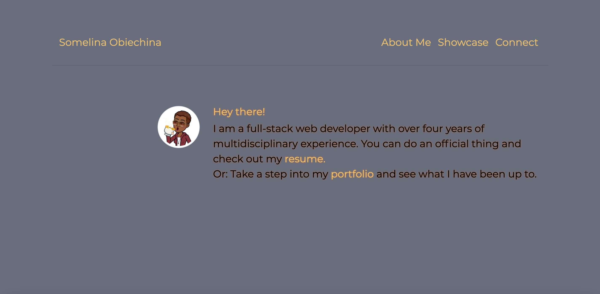

# Portfolio

A bootstrap responsive portfolio that renders well on a variety of devices and window or screen sizes.

## Installation

1. Install any web browser with HTML5 capabilities.
2. Open live link in ##Tests section to run web application

# Page (Index.html, portfolio.html, contact.html, PortfolioStyle.css) Properties:

1. External css style sheet to set the background/font/color theme of all three pages
2. Linked all pages to the index page
3. Images inputted into columns and rows as created by bootstrap
4. Added form in contact page
5. Bootstrap styling for all columns, rows and grids.
6. Bootstrap sticky footer
7. HTML and CSS comments on applicable webpages
8. Social media link on contact page
9. Linked credits in footers
10. Bootstrap linked to all HTML pages.
11. CSS folder for CSS file
12. All images organised into one folder
13. Semantic HTML tags and alt links in images

## Credits

1. Trilogy Education Services, a 2u, Inc. brand.
2. Bootstrap
3. Google Fonts

## Screenshots

The following shows the web applications appearance and functionality:

## Badges

## Tests

To test HTML pages(index, portfolio and contact), open in web browser and follow links at the menu header level.
![LiveLink][https://ifeasome.github.io/Portfolio/]

## License

© 2019 Trilogy Education Services, a 2U, Inc. brand. All Rights Reserved. 
© 2020 Somelina Obiechina
